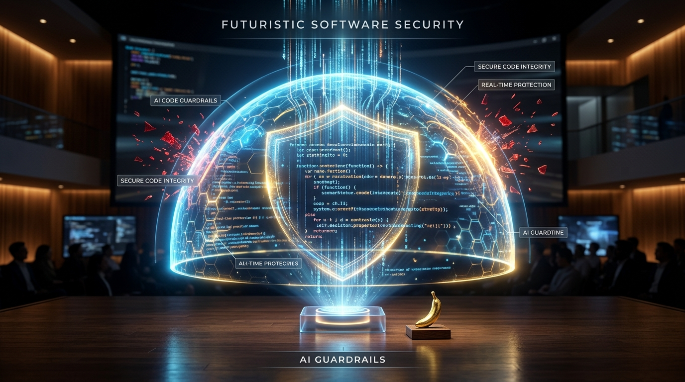
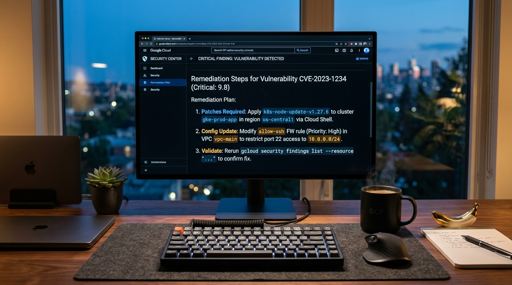

# Code at the Speed of Thought. Ship with Ironclad Trust.



Every once in a while, a new technology comes along that completely changes how we create. 

Over the past year, we’ve all felt that magic. You sit down with an idea, describe it in plain words, and within seconds, working software comes to life before your eyes. It feels like pure creative freedom. It feels like flying.

But then comes the moment you want to share it with the world. You want to deploy it to real users, inside real companies. And suddenly, a familiar knot tightens in your stomach. 

Did the AI leave an API key hardcoded in the repository? Is that FastAPI route quietly exposed to the entire internet without authentication? Is an unguarded LLM endpoint vulnerable to prompt injection? 

In an instant, the thrill of creation collides with the friction of fear. Developers find themselves caught between two impossible choices: ship fast and risk catastrophic vulnerabilities, or spend weeks manually auditing code they didn’t write line-by-line.

Today, we are changing that forever.

---

### Introducing Vibe Guard

**Vibe Guard** is the autonomous AI security architect designed from the ground up for the era of vibe coding. 

It bridges the gap between rapid, intuitive AI prototyping and rigorous, enterprise-grade cloud production on Google Cloud. It doesn’t get in your way. It doesn’t tell you to stop building. Instead, it acts as your silent, vigilant partner—instantly analyzing your project, identifying non-conformities, and handing you the exact, cloud-native blueprint to make it unbreakable.



---

### Simplicity Is the Ultimate Sophistication

Great tools shouldn't require a manual. With Vibe Guard, securing an AI-generated codebase is as effortless as generating it in the first place:

1. **You just provide your repository URL.** Vibe Guard clones a lightweight snapshot into an ephemeral, isolated workspace. It never executes untrusted code and purges every trace the moment the scan completes.
2. **You get deterministic, zero-noise precision.** Built on industry-standard static analysis engines, Vibe Guard evaluates your project against four non-negotiable pillars: **AUTH** (Authentication & IAM), **SECRETS** (Credentials & Token Leaks), **LLM-GOV** (Model Gateways & Prompt Armor), and **NET-ISO** (Network & Container Isolation).
3. **You receive actionable, GCP-native remediations.** Powered by Gemini on Vertex AI, Vibe Guard doesn't just hand you an error code. It gives you contextual, copy-paste-ready remediations targeting Cloud Run, Secret Manager, Identity-Aware Proxy (IAP), and Vertex AI.

```
┌─────────────────────────────────────────────────────────────┐
│  VIBE GUARD SCAN REPORT                                      │
│  Target: my-vibe-app (FastAPI + Cloud Run)                  │
│  Status: 2 Non-Conformities Detected                        │
│                                                             │
│  [CRITICAL] SECRETS-001: OpenAI API Key hardcoded in env    │
│  ↳ Remediation: Migrate secret to GCP Secret Manager        │
│    $ gcloud secrets create api-key --data-file=.env         │
│                                                             │
│  [HIGH]     NET-ISO-001: Container binds 0.0.0.0 directly  │
│  ↳ Remediation: Enforce Cloud Run internal ingress + IAP   │
└─────────────────────────────────────────────────────────────┘
```

---

### The Deeper Why: Unlocking Fearless Creation

This is about much more than catching syntax errors or scanning dependencies. 

It is about **trust**.

When developers and founders no longer have to worry about the invisible vulnerabilities lurking in generated code, their creative potential is unleashed. Prototyping on Friday night means shipping safely on Monday morning. Enterprise teams can finally embrace rapid AI exploration without compromising compliance, privacy, or security posture.

---

### A Glimpse of What's Next

The future of software is not humans painstakingly typing millions of lines of boilerplate. The future is humans orchestrating intelligent agents that build, verify, deploy, and monitor living software systems seamlessly.

Vibe Guard is our first major step toward that future—a world where software can be created at the speed of thought, with the resilience of the most secure systems ever built.

---

### Experience Vibe Guard Today

Vibe Guard is available now as an autonomous Agent-to-Agent (A2A) service on Google Cloud. 

**Stop wondering if your vibe-coded apps are secure. Know they are.**

*Go build something extraordinary. We’ve got your back.*
