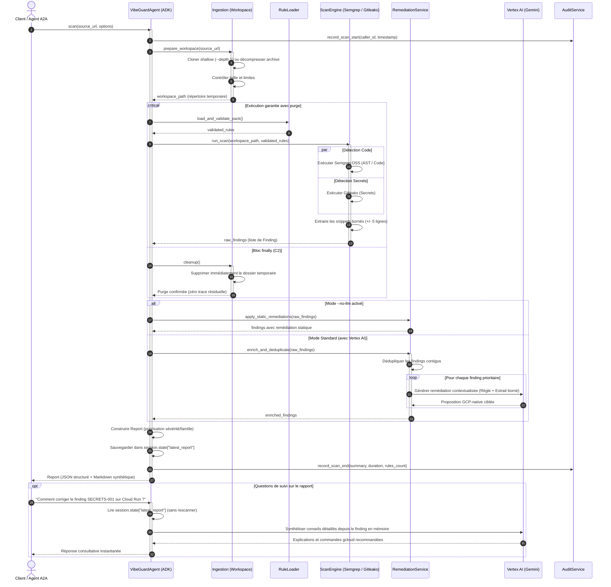

# Architecture & Workflows — Vibe Guard

Ce document détaille l'architecture logicielle et le cycle de vie d'exécution de l'agent **Vibe Guard**, conformément aux spécifications du plan d'implémentation (`plan-implementation-agent-vibe-coding.md`), aux ADRs (ADR-001 à ADR-008) et aux bonnes pratiques de l'écosystème Google ADK / A2A.

---

## 1. Schéma d'Architecture Globale (Composants et Dépendances)

L'architecture sépare rigoureusement la **détection statique déterministe** (Semgrep, Gitleaks) de la **génération d'intelligence contextuelle** (Gemini via Vertex AI), le tout orchestré par un agent Google ADK exposé en A2A sur Google Cloud Run.

```mermaid
flowchart TB
    subgraph ClientLayer ["Couche Clients & Écosystème"]
        User(["Développeur / Auditeur"])
        A2AClient["Agent Appelant / Orchestrateur A2A"]
    end

    subgraph SecurityBoundary ["Périmètre de Sécurité Cloud Run (Non-Root / Distroless)"]
        subgraph AgentLayer ["Couche Agent ADK (src/vibe_guard/agent)"]
            A2AEndpoint["Point de terminaison A2A\n(/.well-known/agent.json)"]
            RootAgent["VibeGuardAgent (LlmAgent ADK)"]
            SessionState[("session.state\n(latest_report en cache)")]
            ScanTool["Outil Agent: scan(source, options)"]
        end

        subgraph IngestionLayer ["Ingestion Éphémère (src/vibe_guard/ingest)"]
            WorkspaceManager["Workspace Manager\n(Validation & Limites)"]
            EphemeralDir[("Répertoire Éphémère\n/tmp/vibe_guard_scan_*\n[PURGÉ EN FINALLY]")]
        end

        subgraph EngineLayer ["Moteur de Scan Déterministe (src/vibe_guard/engine)"]
            ScanEngine["ScanEngine (Orchestrateur)"]
            SemgrepProc["Semgrep OSS Runner\n(Subprocess AST/Code)"]
            GitleaksProc["Gitleaks Runner\n(Subprocess Secrets)"]
            SnippetExtractor["SnippetExtractor\n(Fenêtre bornée +/- 5 lignes)"]
        end

        subgraph RulesRepository ["Référentiel de Règles Déclaratif (rules/)"]
            PackManifest["pack.yaml (Manifeste & Version)"]
            RuleAuth["Règles AUTH (AUTH-001..003)"]
            RuleSecrets["Règles SECRETS (SECRETS-001..003)"]
            RuleLlmGov["Règles LLM-GOV (LLM-GOV-001..003)"]
            RuleNetIso["Règles NET-ISO (NET-ISO-001..003)"]
            RuleLoader["RuleLoader (Pydantic Schema Validation)"]
        end

        subgraph RemediationLayer ["Rapport & Remédiation (src/vibe_guard/remediation)"]
            RemediationEngine["RemediationService"]
            Deduplicator["Déduplication & Regroupement"]
            PromptTemplates["Prompts Versionnés\n(Contextualisation GCP)"]
            ReportBuilder["ReportBuilder (JSON / Markdown)"]
        end

        subgraph AuditLayer ["Audit & Traçabilité (src/vibe_guard/audit)"]
            AuditLogger["AuditService (C6)\n[Métadonnées seules : durée, règles, caller]"]
        end
    end

    subgraph ExternalServices ["Services Google Cloud & Externes"]
        VertexAI["Vertex AI / Gemini 2.5 Flash\n(Génération de remédiation & Dédup)"]
        CloudLogging["Google Cloud Logging (Audit Sinks)"]
        GitRepo["Dépôt Git Source (Clone shallow --depth 1)"]
        SecretManager["GCP Secret Manager (Configuration & Clés)"]
    end

    %% Flux d'invocation
    User -->|Requête Scan| A2AEndpoint
    A2AClient -->|Protocole JSON-RPC / A2A| A2AEndpoint
    A2AEndpoint --> RootAgent
    RootAgent <--> SessionState
    RootAgent -->|Exécute| ScanTool

    %% Ingestion
    ScanTool --> WorkspaceManager
    GitRepo -.->|git clone --depth 1| WorkspaceManager
    WorkspaceManager --> EphemeralDir

    %% Scan et Règles
    ScanTool --> ScanEngine
    PackManifest & RuleAuth & RuleSecrets & RuleLlmGov & RuleNetIso --> RuleLoader
    RuleLoader --> ScanEngine
    ScanEngine --> SemgrepProc & GitleaksProc
    SemgrepProc & GitleaksProc -->|Analyse statique sur| EphemeralDir
    EphemeralDir --> SnippetExtractor
    SnippetExtractor --> ScanEngine

    %% Remédiation et Rapport
    ScanEngine --> RemediationEngine
    RemediationEngine --> Deduplicator
    Deduplicator --> PromptTemplates
    PromptTemplates -->|Extraits bornés uniquement (C2)| VertexAI
    VertexAI -->|Remédiation contextualisée| RemediationEngine
    RemediationEngine --> ReportBuilder
    ReportBuilder --> RootAgent

    %% Audit & Secrets
    ScanTool --> AuditLogger
    AuditLogger -.->|Logs structurés| CloudLogging
    SecretManager -.->|Injection runtime| SecurityBoundary
```

---

## 2. Schéma de Workflow Séquentiel (Cycle de Vie d'un Scan)

Ce diagramme illustre le déroulement complet d'un scan, depuis la requête de l'utilisateur jusqu'au rendu final et à l'interaction conversationnelle sans re-scan.



---

## 3. Matrice de Sécurité et Alignement des Contraintes (C1 à C7)

| Contrainte | Composant Responsable | Mécanisme d'application |
|---|---|---|
| **C1 : Analyse statique uniquement** | `vibe_guard.engine` | Aucun build, aucun `exec`/`eval`, aucun chargement dynamique. Le code est lu comme de la donnée brute. |
| **C2 : Code sensible & éphémère** | `vibe_guard.ingest` + `SnippetExtractor` | Dossier temporaire purgé systématiquement en bloc `finally`. Seuls des extraits bornés (±5 lignes) sont transmis à Vertex AI. |
| **C3 : Réutilisation de l'OSS** | Semgrep OSS + Gitleaks | Outils standards de référence pour le code et les secrets ; aucun moteur de parsing regex fait maison. |
| **C4 : Référentiel déclaratif** | `rules/` + `vibe_guard.rules` | Format YAML enveloppant, validé par schéma Pydantic, extensible par de simples fichiers YAML sans toucher au code Python. |
| **C5 : Cible GCP-native** | `vibe_guard.remediation` | Toutes les remédiations recommandent l'écosystème managé : Cloud Run, Secret Manager, Identity-Aware Proxy (IAP), Vertex AI. |
| **C6 : Audit & Traçabilité** | `vibe_guard.audit` | Enregistrement de chaque scan : identifiant appelant, horodatage, hash/version du pack, règles évaluées, durée. **Le code scanné n'est jamais consigné**. |
| **C7 : Pas de métrique inventée** | `tests/eval/` | Précision et rappel validés exclusivement contre les fixtures internes annotées (`findings.expected.yaml`). |
