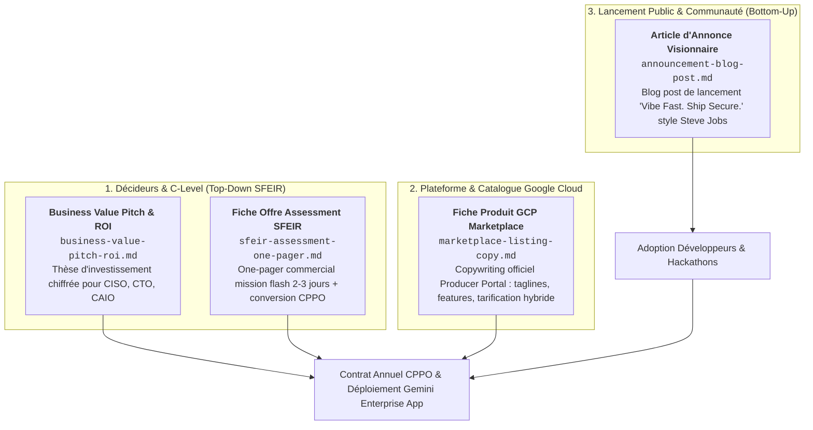

# Kit de Communication & Go-To-Market : Vibe Guard

Ce dossier rassemble l'ensemble des supports de communication, supports de vente et assets marketing développés pour le lancement et la commercialisation de **Vibe Guard** sur la **Google Cloud Marketplace** et au travers de l'écosystème **SFEIR & Google Cloud**.

---

## Vue d'Ensemble des Supports Produits

---

## Index Détaillé des Fichiers

| Fichier | Cible / Canal | Objectif Principal |
|---|---|---|
| [**`business-value-pitch-roi.md`**](business-value-pitch-roi.md) | CISO, CTO, Head of Platform, DSI | Démontrer le coût de l'inaction (Shadow AI), la réduction du cycle de mise en production de 85 %, et un modèle de ROI à 3 ans (+289 %). |
| [**`marketplace-listing-copy.md`**](marketplace-listing-copy.md) | Google Cloud Marketplace / Acheteurs GCP | Fiche produit officielle pour le Google Cloud Producer Portal : description courte/longue, compatibilité technique, modèle hybride (1,99 $ / scan + CPPO). |
| [**`sfeir-assessment-one-pager.md`**](sfeir-assessment-one-pager.md) | Account Managers, Tech Leads & Consultants SFEIR | Support de vente 1-page pour déclencher des missions d'audit d'industrialisation (2-3 jours) chez les clients grands comptes et closer des offres privées CPPO. |
| [**`SFEIR_Vibe_Coding_Security_Assessment.pptx`**](SFEIR_Vibe_Coding_Security_Assessment.pptx) | Clients C-Level, CISO, CTO, DSI | Support de présentation 10 slides au format officiel SFEIR (The Sharp Artisan v2026.1). |
| [**`deck_spec_sfeir_assessment.json`**](deck_spec_sfeir_assessment.json) | Consultants & Presales SFEIR | Spécification JSON reproductible du deck avec les règles de branding et de tonalité. |
| [**`announcement-blog-post.md`**](announcement-blog-post.md) | Presse tech, communauté dev, réseaux sociaux, Medium / Blog SFEIR | Récit inspirant et percutant de lancement : réconcilier la magie du vibe coding avec la rigueur de l'infrastructure cloud d'entreprise. |
