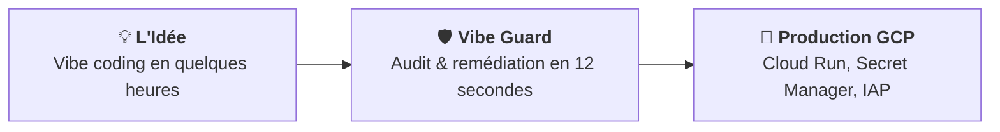

# Vibe Fast. Ship Secure.

**Par l'équipe Vibe Guard & SFEIR**  
*18 septembre 2026*

---

### Vous connaissez cette sensation.

Il est 15 heures. Vous venez de passer trois heures devant un outil de génération de code par IA — Cursor, Lovable, Bolt ou v0. Vous n'avez pas écrit une seule ligne de boilerplate. Vous avez simplement décrit votre vision, itéré par la pensée, guidé le modèle.

Et le miracle s'est produit. Votre application tourne. Elle est belle, interactive, fonctionnelle. Vous ressentez cette montée d'adrénaline pure : **le pouvoir de créer à la vitesse de la pensée**. C'est cela, la promesse du *vibe coding*.

Puis vient le lendemain matin.

Vous montrez fièrement votre prototype à votre Lead Architecte et à votre RSSI. Et en dix secondes, la fête est terminée.  
*"Où sont stockées les clés d'API ?"* — Dans le code.  
*"Comment est gérée l'authentification ?"* — Il n'y en a pas.  
*"Le conteneur tourne sous quel utilisateur ?"* — En root, sur le port 8000, sans reverse proxy.  
*"Où partent les données envoyées au LLM ?"* — Vers une API externe non bridée, sans passerelle ni budget.

Le verdict tombe, froid et implacable : **Interdiction formelle de déployer en production**. Votre prototype est condamné à mourir dans un dossier local ou à attendre trois mois de réécriture manuelle d'infrastructure.

La vélocité de l'IA venait de se fracasser contre le mur de la sécurité d'entreprise.

---

### Aujourd'hui, nous changeons cela pour toujours.

Voici **Vibe Guard**.

Vibe Guard est le premier agent autonome d'industrialisation du vibe coding conçu nativement pour l'écosystème Google Cloud. 

Son rôle n'est pas de freiner votre élan ou de vous accabler de rapports incompréhensibles de 80 pages. Son rôle est de transformer, en **moins de 15 secondes**, n'importe quelle application générée par IA en un service **conforme, sécurisé et prêt pour la production Google Cloud**.

---

### La simplicité absolue.

La vraie sophistication, c'est la simplicité. Utiliser Vibe Guard ne demande aucune compétence en sécurité offensive, aucun apprentissage d'un nouvel outil complexe.

**Vous restez dans votre flux de travail :**

1. **Vous dialoguez avec votre Gemini Enterprise App** :  
   Dans l'application conversationnelle privée de votre entreprise, vous partagez simplement le lien de votre dépôt interne :  
   `"Peux-tu vérifier mon prototype avec Vibe Guard avant que je le présente au comité ?"`.

2. **L'analyse s'exécute en sous-main, sans rien stocker** :  
   Vibe Guard inspecte la base de code de manière déterministe et éphémère. Il analyse les failles critiques d'identité (`AUTH`), de secrets (`SECRETS`), de gouvernance IA (`LLM-GOV`) et d'exposition réseau (`NET-ISO`). Dès l'analyse terminée, l'espace de travail est définitivement détruit. Vos données ne quittent jamais votre périmètre cloud.

3. **Vous recevez la solution, pas juste le problème** :  
   Vibe Guard, propulsé par **Gemini 3.8 Flash**, ne se contente pas de dire *"cette ligne est vulnérable"*. Il vous donne le code Terraform exact, la ligne de commande `gcloud` prête à coller, et configure automatiquement **Google Cloud Secret Manager**, **Identity-Aware Proxy (IAP)** et **Cloud Run**.

En un clic, votre prototype devient une application d'entreprise.

---

### Pourquoi c'est important.

Ce n'est pas une question de conteneurs ou de fichiers de configuration. C'est une question de **liberté créative**.

Le mouvement du vibe coding permet à des dizaines de milliers de collaborateurs — développeurs, chefs de produit, designers, experts métier — de devenir des créateurs de logiciels. Mais cette créativité n'a de valeur que si elle peut être partagée et utilisée sans mettre en péril l'organisation.

En automatisant le passage de relais entre le code généré et l'infrastructure d'entreprise, Vibe Guard réconcilie ce qui semblait irréconciliable : **la vélocité radicale des créateurs et l'exigence intransigeante des responsables de sécurité**.

Les équipes de sécurité ne sont plus des censeurs obligés de dire *"non"*. Elles deviennent les architectes d'une plateforme où chacun peut innover en toute sécurité.

---

### L'avenir se construit dès maintenant.

Nous sommes à l'aube d'une transformation profonde de l'ingénierie logicielle. Demain, la quasi-totalité du code sera amorcée par des agents d'intelligence artificielle. Les entreprises qui réussiront ne sont pas celles qui interdiront cette vague, mais celles qui sauront l'industrialiser avec confiance et élégance.

Vibe Guard est disponible dès aujourd'hui sur la **Google Cloud Marketplace** :
* **Déploiement en 1-clic** au sein de votre tenant privé Google Cloud.
* **Intégration directe** dans votre Gemini Enterprise App.
* **Financement transparent** sur vos engagements Google Cloud existants (EDP) via nos offres privées (CPPO) opérées par **SFEIR**.

Ne choisissez plus entre aller vite et être sécurisé. Faites les deux.

**Bienvenue dans l'ère de la production en toute confiance.**

---

*Découvrez Vibe Guard sur la Google Cloud Marketplace et demandez un diagnostic Vibe Coding avec les experts SFEIR sur [sfeir.com](https://sfeir.com).*
