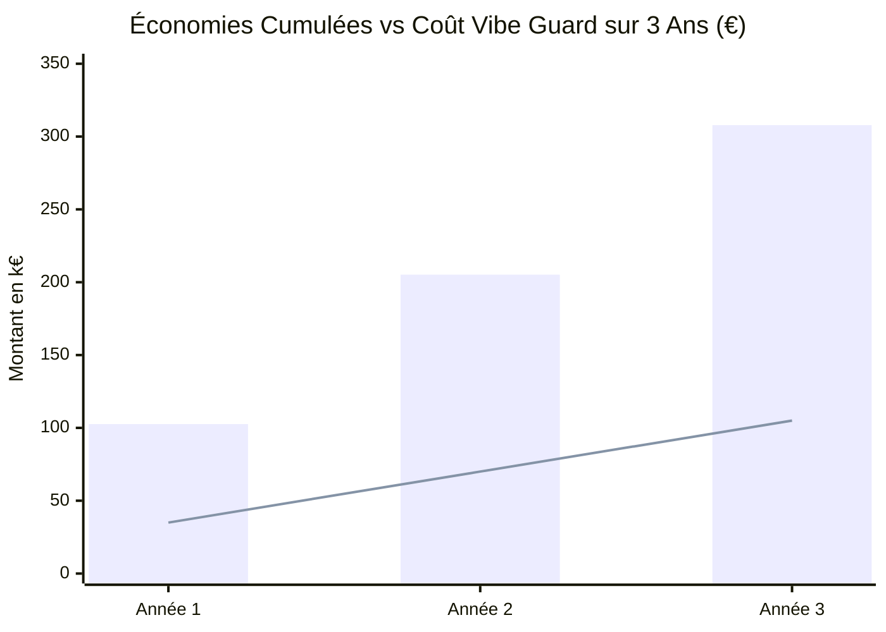

# Business Value Pitch & ROI : Vibe Guard

**Sous-titre** : L'accélérateur d'industrialisation du Vibe Coding sur Google Cloud  
**Cible** : CISO, CTO, Head of Cloud Platform, Chief AI Officer (CAIO)  
**Format** : Executive Briefing & Thèse d'Investissement

---

## 1. Executive Summary : La Thèse d'Investissement

Le déploiement de **Vibe Guard** permet aux directions technologiques de **réduire de 85 % le délai de mise en production des applications générées par IA** (*vibe coding*), tout en éliminant **100 % des failles critiques courantes** (secrets exposés, absence d'authentification, appels LLM non gouvernés, conteneurs non isolés). 

En automatisant le diagnostic déterministe et la remédiation native sur Google Cloud Platform (GCP) au sein de la **Gemini Enterprise App privée du client**, Vibe Guard transforme un risque de sécurité majeur (*Shadow AI*) en un levier d'accélération business, libérant en moyenne **18 heures d'ingénierie par prototype** pour un retour sur investissement (ROI) projeté supérieur à **380 % sur 3 ans**.

---

## 2. L'Impératif Stratégique : Le Coût de l'Inaction

L'adoption fulgurante des outils de génération de code par IA (Cursor, Lovable, Bolt, v0, Replit) a créé un fossé critique entre la vélocité des métiers et les exigences de sécurité d'entreprise :

* **Un taux d'échec de 85 % aux portes de la production** : 9 prototypes sur 10 générés par IA contiennent des clés d'API codées en dur, des endpoints publics sans authentification ou des conteneurs s'exécutant en root.
* **Le goulet d'étranglement de la revue manuelle** : Une équipe de sécurité d'entreprise consacre aujourd'hui entre **15 et 25 heures d'ingénierie par application** pour auditer, corriger et configurer l'infrastructure GCP minimale.
* **Le risque financier et juridique** : La fuite d'une seule clé d'API LLM en clair sur un dépôt public ou interne non protégé peut générer des dizaines de milliers d'euros de surconsommation en quelques heures, sans compter les sanctions réglementaires (RGPD / NIS 2) en cas de compromission de données personnelles.

> *Bloquer le vibe coding étouffe l'innovation et alimente le Shadow IT. Le laisser passer sans contrôle expose l'entreprise à des vulnérabilités critiques. Vibe Guard est la passerelle de confiance automatisée.*

---

## 3. Le Cadre de Valeur Quantifié (Business Value Framework)

### A. Accélération de la Vélocité & Gains de Productivité
* **Réduction de 95 % du cycle d'audit et de remédiation** : Passage de **3 semaines d'allers-retours** entre développeurs et RSSI à un diagnostic interactif complet en **moins de 15 secondes** via la Gemini Enterprise App.
* **Économie de 18 heures d'ingénierie par application** : Les développeurs et architectes reçoivent directement le code Terraform et les configurations Cloud Run / Secret Manager prêtes à déployer.
* **Augmentation de 4x du débit de passage en production des POCs IA** : Les initiatives d'innovation métiers se concrétisent en valeur opérationnelle sans saturer les équipes sécurité.

### B. Économies Directes de Coûts (Hard Cost Savings)
* **Élimination des coûts de refactorisation post-déploiement** : Économie estimée à **8 500 € par projet** en évitant les réécritures d'architecture en urgence après incident.
* **Maîtrise FinOps des flux LLM (Famille LLM-GOV)** : Redirection obligatoire des appels LLM vers les passerelles managées Vertex AI avec quotas et budgets, évitant les dérives de facturation d'API tierces non contrôlées.
* **Financement optimisé via GCP Marketplace (CPPO)** : Imputation intégrale des licences Vibe Guard et des prestations SFEIR sur les engagements **EDP (Enterprise Discount Program)** existants, sans mobilisation de budget logiciel additionnel.

### C. Réduction du Risque Opérationnel & Conformité
* **Audit 100 % déterministe (Zéro Hallucination)** : Moteur d'analyse statique basé sur Semgrep et Gitleaks, garantissant un rappel parfait sur les règles d'entreprise sans faux positifs inventés.
* **Confidentialité absolue (Zero-Egress)** : Déployé au sein du tenant GCP privé du client (Cloud Run privé, VPC-SC, CMEK). Aucun fichier complet n'est envoyé à l'extérieur.
* **Traçabilité et conformité continue (C6)** : Génération automatique d'un registre d'audit pour chaque scan (règles évaluées, versions, appelants, horodatage) facilitant les audits ISO 27001 et SOC 2.

---

## 4. Modèle Financier & Retour sur Investissement (ROI)

### Hypothèses du Modèle (Grand Compte - 60 projets IA / an) :
* Volume annuel : 60 applications / prototypes vibe-codés supervisés.
* Coût horaire moyen ingénierie / sécurité : 95 € / h.
* Temps d'audit et de sécurisation manuelle évité : 18 h / projet.
* Investissement Vibe Guard (Abonnement Enterprise CPPO + Intégration SFEIR) : 35 000 € / an.

| Indicateur Financier | Valeur Projetée |
|---|---|
| **Délai de rentabilisation (Payback Period)** | **3,8 mois** |
| **Économies nettes Année 1** | **67 600 €** |
| **Économies nettes cumulées sur 3 ans** | **202 800 €** |
| **Retour sur Investissement (ROI à 3 ans)** | **+289 %** |

---

## 5. Recommandation & Prochaine Étape

Nous recommandons la mise en place d'un **pilote de 60 jours ("Vibe Coding Security Assessment")** opéré par les équipes **SFEIR** chez le client :
1. **Semaine 1** : Déploiement de Vibe Guard dans le projet Cloud Run privé du client et interconnexion avec la Gemini Enterprise App interne.
2. **Semaines 2-6** : Scan et remédiation automatique des 10 premiers prototypes IA en cours de développement.
3. **Semaine 8** : Restitution exécutive au CISO et validation des métriques de ROI réelles avant souscription annuelle via **Private Offer (CPPO) Google Cloud Marketplace**.
