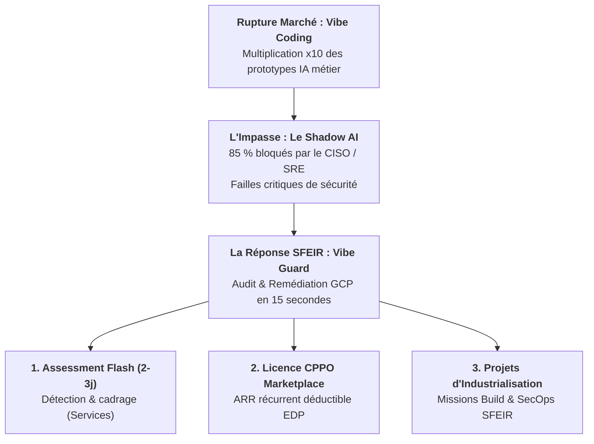
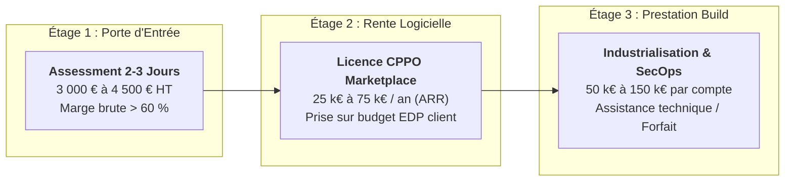
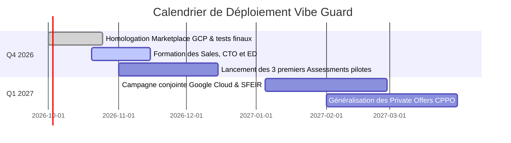

# NOTE STRATÉGIQUE AU COMEX SFEIR

**Date** : 18 septembre 2026  
**Objet** : Lancement commercial de **Vibe Guard** — Industrialisation du Vibe Coding & Monétisation Google Cloud Marketplace  
**Émetteurs** : CTO et ED (Engineering Directors) / Direction des Alliances & Partenariats  
**Destinataires** : Membres du Comité Exécutif (COMEX) SFEIR  
**Statut** : Document d'arbitrage et de décision stratégique  

---

## 1. Synthèse Exécutive (Executive Summary)

L'irruption massive du **vibe coding** (génération d'applications via Cursor, Lovable, Bolt, v0) bouleverse le modèle traditionnel des ESN : les phases de prototypage et d'écriture de boilerplate ne se facturent plus en semaines-hommes. En contrepartie, **85 % des applications générées par IA échouent à passer en production** en raison de failles critiques d'architecture et de sécurité (*Shadow AI*, clés d'API en clair, absence d'authentification, conteneurs non isolés).

Pour SFEIR, l'enjeu n'est pas de subir cette déflation de charge, mais de **monter d'un cran dans la chaîne de valeur** en devenant le garant incontournable de l'industrialisation logicielle sur Google Cloud.

Nous soumettons au COMEX l'approbation du lancement commercial de **Vibe Guard**, notre agent autonome d'audit et de remédiation GCP-native. Vibe Guard est packagé pour la **Google Cloud Marketplace** et directement intégré au sein de la **Gemini Enterprise App** déployée dans le tenant privé de nos clients grands comptes.

Cette initiative combine :
1. **Une offre d'appel flash à haute marge** (*Vibe Coding Assessment* de 2 à 3 jours, 3 000 € à 4 500 € HT).
2. **Une nouvelle source de revenus récurrents (ARR)** via des *Customer Partner Private Offers* (CPPO) sur la Marketplace (25 k€ à 75 k€ / an par compte).
3. **Un puissant moteur d'entraînement de services de Build & SecOps** (50 k€ à 150 k€ de prestation par passage en production).
4. **Zéro friction budgétaire pour le client** grâce à l'imputation intégrale sur ses engagements financiers pluriannuels **EDP (Enterprise Discount Program)** déjà signés avec Google Cloud.

---

## 2. Contexte & Opportunité Stratégique pour SFEIR

### A. La fin de la rente de dev et l'émergence du besoin d'arbitrage
Les développeurs et les directions métier prototypent désormais en quelques heures ce qui nécessitait auparavant des sprints entiers. Les DSI et RSSI du CAC 40 sont submergés de projets non maîtrisés :
* L'interdiction pure et simple crée du ressentiment et amplifie le *Shadow IT*.
* Laisser passer sans contrôle expose l'entreprise à des fuites de données et des dérives budgétaires d'API.
* Les équipes sécurité centrales n'ont pas la bande passante humaine pour auditer chaque prototype (15 à 25 heures de revue manuelle requises par application).

### B. Le positionnement SFEIR : The Sharp Artisan au service de la production
Vibe Guard matérialise le positionnement historique de SFEIR : **l'excellence technique et l'artisanat du logiciel appliqué aux exigences industrielles**. En automatisant les contrôles déterministes et en générant le code d'infrastructure de remédiation, SFEIR se positionne non comme un censeur, mais comme l'accélérateur qui permet aux métiers de déployer en conformité.

---

## 3. L'Actif Technologique : Vibe Guard

Développé selon les principes stricts d'ingénierie Google Cloud, Vibe Guard se distingue radicalement des scanners de vulnérabilités généralistes :

| Dimension | Scanner de Sécurité Traditionnel | Vibe Guard (SFEIR) |
|---|---|---|
| **Cible d'analyse** | Vulnérabilités CVE / Dépendances | Failles spécifiques au code généré par IA (`AUTH`, `SECRETS`, `LLM-GOV`, `NET-ISO`) |
| **Résultat fourni** | Rapport passif de 50 pages listant des alertes | **Remédiation active** : Code Terraform, manifests Cloud Run et commandes `gcloud` prêts à déployer |
| **Moteur IA** | Absent ou générique | **Gemini 3.8 Flash** via Vertex AI pour une contextualisation précise du code |
| **Canal utilisateur** | Console complexe réservée aux experts SecOps | **Conversationnel** au sein de la **Gemini Enterprise App** privée du client |
| **Souveraineté (Zero-Egress)** | Données souvent envoyées sur un SaaS externe | **100 % hébergé dans le tenant GCP du client**, scan éphémère sans persistance de code |

---

## 4. Modèle Économique & Effet de Levier pour SFEIR

Le modèle commercial repose sur un entonnoir de conversion à trois étages particulièrement vertueux :

### A. Pourquoi l'argument EDP débloque les cycles de vente
Les grands comptes disposent d'engagements pluriannuels de dépenses (**EDP / CUD**) auprès de Google Cloud. En fin d'exercice, de nombreux clients recherchent des leviers pour consommer leurs reliquats de crédits sous peine de les perdre (*use-it-or-lose-it*).
* Une **Private Offer (CPPO)** passée par SFEIR sur la Marketplace s'impute à **100 % sur l'engagement EDP**.
* Le client n'a pas besoin de débloquer de nouveau budget : l'opération est transparente pour sa direction financière.
* Le cycle de décision est réduit de 4 mois à **moins de 3 semaines**.

### B. Projections Financières à 12 Mois (Scénario Conservateur)

Sur la base d'un déploiement auprès de 15 clients grands comptes de notre portefeuille existant :

| Ligne de Revenu | Métrique de Calcul | Chiffre d'Affaires Brut | Marge Brute Estimée |
|---|---|---|---|
| **Missions Assessment Flash** | 20 missions vendues (3 800 € moy.) | 76 000 € | 48 000 € (63 %) |
| **Licences Vibe Guard (CPPO)** | 10 souscriptions annuelles (35 000 € moy.) | 350 000 € | 280 000 € (80 %) |
| **Missions d'Industrialisation (Build)** | 6 projets d'accompagnement (80 000 € moy.) | 480 000 € | 192 000 € (40 %) |
| **TOTAL AN 1** | — | **906 000 €** | **520 000 € (57 %)** |

---

## 5. Synergies avec le Partenariat Google Cloud

Ce lancement renforce stratégiquement l'alliance SFEIR - Google Cloud sur trois volets majeurs :
1. **Co-selling actif avec les équipes Google (CE / AE)** : Vibe Guard accélère directement la consommation des services managés à forte marge de Google Cloud (**Cloud Run, Secret Manager, Vertex AI, Identity-Aware Proxy**). Les commerciaux Google sont directement incités à positionner l'offre.
2. **Valorisation de notre expertise Gemini Enterprise** : SFEIR s'affirme comme le partenaire de référence capable de déployer et d'enrichir les **Gemini Enterprise Apps** d'entreprise avec des agents métier et techniques à forte valeur ajoutée.
3. **Visibilité Partenaire Premier** : Présentation de Vibe Guard lors des événements phares de l'écosystème (Google Cloud Summit, Hackathons GenAI, DevFest).

---

## 6. Plan de Déploiement & Risques Maîtrisés

### A. Calendrier Opérationnel

### B. Analyse et Maîtrise des Risques

* **Risque de responsabilité sur le code scanné** : Vibe Guard fournit des recommandations d'architecture basées sur des règles d'analyse statique déterministes. Les scripts générés sont toujours soumis à la validation humaine du développeur (*Human-in-the-loop*). Les CGU de l'offre précisent le cadre d'assistance sans transfert de responsabilité légale du run.
* **Risque de fuite de données client** : Aucun risque grâce au modèle architectural **Zero-Egress** (C1/C2). L'agent s'exécute dans l'environnement GCP du client, sans stockage intermédiaire et avec purge systématique des conteneurs à l'issue de chaque scan.
* **Risque de charge pour les équipes SFEIR** : L'assessment étant automatisé à 85 %, une mission de 3 jours mobilise moins de 1,5 jour effectif d'un consultant expérimenté, garantissant une forte scalabilité et une excellente rentabilité.

---

## 7. Décisions et Arbitrages Sollicités auprès du COMEX

Il est demandé aux membres du COMEX de valider :

1. **Validation du Lancement Commercial** : Approbation de la commercialisation de l'offre *Vibe Coding Security Assessment* et de son référencement au catalogue des offres d'appel SFEIR.
2. **Autorisation de Distribution sur Google Cloud Marketplace** : Mandat pour finaliser l'inscription de Vibe Guard en tant que solution éligible aux *Customer Partner Private Offers* (CPPO) sous l'entité éditeur SFEIR.
3. **Plan d'Enablement Interne** : Organisation d'une session de formation de 2 heures dédiée aux Sales, CTO et ED (Engineering Directors) au cours du mois d'octobre 2026.

---

*Pour tout échange complémentaire ou démonstration en séance, l'équipe projet Vibe Guard reste à l'entière disposition du COMEX.*
