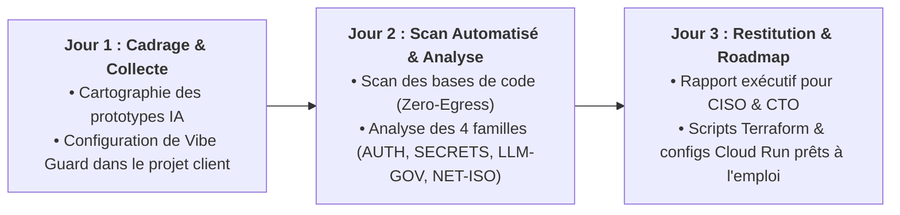

# Offre SFEIR : Vibe Coding Security Assessment

**Format** : One-Pager Commercial / Fiche Offre Partenaire  
**Destinataires** : Sales, CTO, ED (Engineering Directors) & Consultants SFEIR  
**Objectif Commercial** : Déclencher des missions d'audit d'industrialisation (2 à 3 jours) chez les clients grands comptes et convertir vers un contrat annuel Vibe Guard sur Google Cloud Marketplace (CPPO).

---

## 1. L'Accroche Client (Le Pitch en 30 Secondes)

> *"Vos équipes métiers et vos développeurs adorent Cursor, Lovable ou Bolt pour prototyper en quelques heures. Mais quand vient le moment de passer en production, votre RSSI bloque ou vos SRE découvrent des clés d'API en clair et des conteneurs grand ouverts sur Internet.*  
> *Avec l'offre **Vibe Coding Security Assessment**, SFEIR réalise en 48 heures un diagnostic automatisé de vos applications générées par IA et vous livre le plan de remédiation GCP-natif clé en main pour déployer en toute sérénité."*

---

## 2. Ce que l'Offre Comprend (Le Pack 2-3 Jours)

### Livrables Remis au Client :
1. **Rapport d'Audit Exécutif & Tableau de Bord de Vulnérabilités** :  
   Cartographie des risques classés par criticité sur l'ensemble des prototypes scannés.
2. **Pack de Remédiation GCP-Natif "Ready-to-Deploy"** :  
   Configurations Terraform, spécifications Cloud Run avec Identity-Aware Proxy (IAP), et raccordement Secret Manager générés et vérifiés par nos consultants.
3. **Feuille de Route d'Industrialisation** :  
   Recommandations organisationnelles et techniques pour déployer la **Gemini Enterprise App** avec Vibe Guard en continu dans le cycle de livraison logiciel.

---

## 3. Pourquoi le Client Signe Immédiatement ?

* **Budget Zéro Friction (Prise en charge EDP Google Cloud)** :  
  L'assessment ainsi que les licences logicielles Vibe Guard peuvent être imputés directement sur les engagements financiers **EDP (Enterprise Discount Program)** déjà souscrits par le client auprès de Google Cloud via une **Private Offer (CPPO)**.
* **Confidentialité & Conformité CISO Absolues** :  
  L'audit s'exécute **dans l'environnement GCP privé du client**. Aucun code source ne transite vers des serveurs externes. Purge éphémère garantie.
* **Déblocage Immédiat de Projets Métier Stratégiques** :  
  Au lieu de voir des projets IA prometteurs bloqués pendant des mois en comité de sécurité, le client obtient un chemin de mise en conformité en moins de 48 heures.

---

## 4. Modalités Tarifaires & Conversion CPPO

| Composante | Tarification Indicative | Modalité de Facturation |
|---|---|---|
| **Mission Assessment 2-3 Jours** (Consultant Cloud/SecOps SFEIR) | 3 000 € à 4 500 € HT | Prestation de services ou intégrée dans le pack CPPO |
| **Abonnement Annuel Vibe Guard Enterprise** (Scans illimités, support) | 25 000 € à 75 000 € / an | **Private Offer (CPPO) Google Cloud Marketplace** (Déductible à 100 % des crédits EDP du client) |

---

## 5. Déclencheurs de Vente Chez Vos Clients (Signaux Faibles)

* Le client organise un hackathon d'entreprise ou promeut l'usage d'outils GenAI (Cursor, Copilot, Lovable) auprès de ses collaborateurs.
* Le RSSI a récemment interdit un outil SaaS de génération de code par crainte de fuite de propriété intellectuelle.
* Les équipes SRE / Plateforme se plaignent d'applications non gouvernées tournant sur des comptes GCP hors standards.
* Le client a des crédits d'engagements Google Cloud à consommer avant la fin de l'exercice fiscal.

**Contact Référent SFEIR** : CTO & ED (Engineering Directors) — `vibe-guard-team@sfeir.com`
