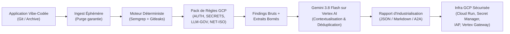
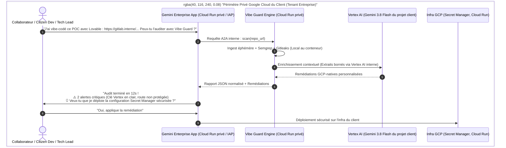
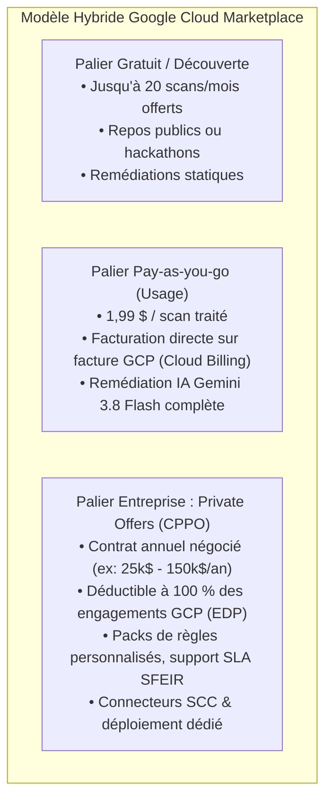
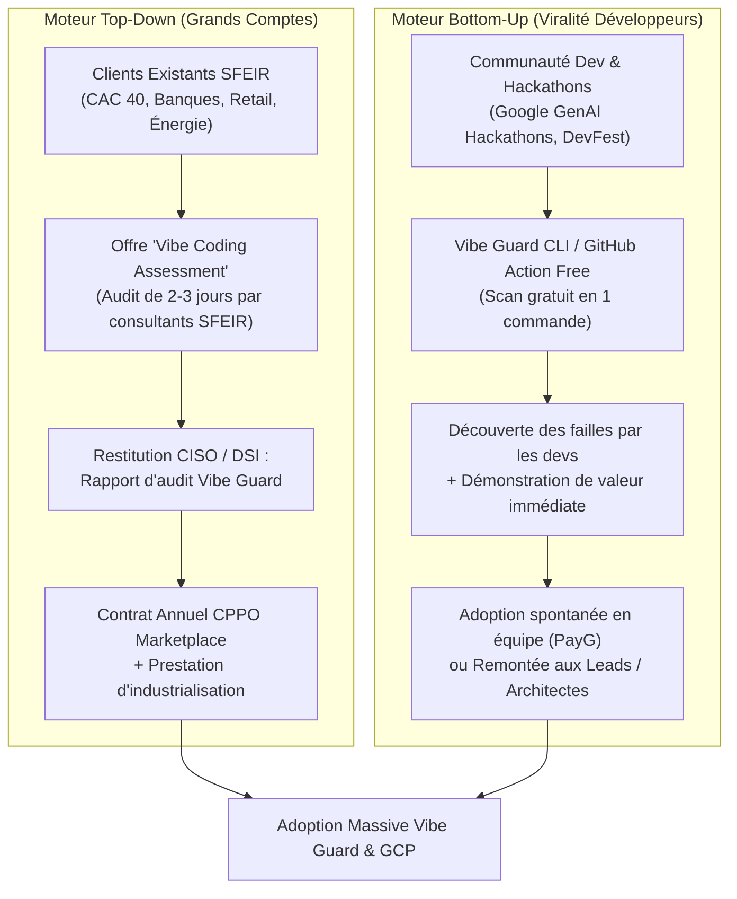

# Stratégie Marketing & Commercialisation : Vibe Guard sur Google Cloud Marketplace

---

## 1. Synthèse Exécutive & Diagnostic de Vibe Guard

### 1.1 Qu'est-ce que Vibe Guard ?
**Vibe Guard** est un agent d'industrialisation et de sécurisation du **"vibe coding"**. Il analyse le code source généré par IA (Cursor, Lovable, Bolt, v0, Replit, Copilot, etc.), détecte automatiquement les non-conformités critiques et génère des remédiations contextualisées ciblant les services natifs de **Google Cloud Platform (GCP)**.

L'agent est conçu nativement selon les standards de l'écosystème Google Cloud :
* **Moteur d'analyse hybride et déterministe** : Détection statique 100 % reproductible via Semgrep OSS et Gitleaks (zéro hallucination de failles), enrichie par **Gemini 3.8 Flash via Vertex AI** uniquement pour la contextualisation des remédiations et la déduplication sémantique.
* **Architecture A2A (Agent-to-Agent)** : Construit sur le **Google Agent Development Kit (ADK)** en Python, exposable sous forme d'Agent Card consommable par d'autres agents.
* **Garantie de confidentialité stricte (Privacy-First)** : Scan éphémère (purge garantie en `finally`), aucune persistance du code, aucun fichier complet envoyé au LLM (uniquement des extraits bornés autour des findings).
* **Quatre familles de règles critiques** :
  1. `AUTH` : Absence d'authentification, mots de passe en clair, configuration IAP manquante.
  2. `SECRETS` : Clés d'API en dur (Gemini, Vertex, OpenAI, Anthropic), fichiers `.env` versionnés, secrets en variables d'environnement non chiffrées.
  3. `LLM-GOV` : Appels directs aux APIs LLM sans passerelle d'entreprise, absence de timeout, risque d'injection de prompt par concaténation de variables.
  4. `NET-ISO` : Services Cloud Run exposés publiquement sans IAP, bind `0.0.0.0` sans reverse proxy, conteneurs root, ports de debug ouverts.

---

## 2. Le Contexte de Marché : Le "Vibe Coding Hangover"

### 2.1 Le paradoxe du Vibe Coding en entreprise
En 2025-2026, le *vibe coding* a bouleversé la vélocité logicielle. Des prototypes fonctionnels, des MVP internes et des POCs métier sont créés en quelques heures par des développeurs ou des profils non techniques.

Cependant, le passage en production se heurte à une réalité brutale :
* **90 % des apps vibe-codées violent les politiques de sécurité élémentaires** : clés d'API loggées en clair, endpoints grand ouverts sur Internet, pas de gestion d'identité, appels LLM non bridés risquant de générer des factures exorbitantes ou des fuites de données.
* **L'impasse SecOps / CISO** : Soit l'équipe sécurité bloque les initiatives (provoquant du Shadow IT et de la frustration), soit elle passe des semaines à auditer et réécrire manuellement le code pour le rendre conforme.

### 2.2 Le positionnement stratégique : "Le Passeport Production pour le Vibe Coding"
Vibe Guard ne combat pas le vibe coding : **il l'industrialise**. 
Il agit comme un **pont de confiance** entre la vélocité débridée des outils de génération de code et la rigueur exigée par les plateformes cloud d'entreprise.

> **Baseline Marketing** :  
> *"Vibe Fast, Ship Secure : L'agent d'industrialisation qui transforme vos prototypes IA en applications de production GCP-natives."*

---

## 3. Personas & Proposition de Valeur

| Persona | Pain Points majeurs | Proposition de Valeur Vibe Guard |
|---|---|---|
| **CISO / Head of AppSec** | Risque massif de fuite de secrets, injection de prompt, applications non gouvernées déployées à l'aveugle. | **Gouvernance déterministe & Privacy-First** : Détection sans hallucination, traçabilité d'audit complète (C6), aucun code source complet ne quitte l'infrastructure. |
| **Head of Cloud Platform / SRE** | Code non conforme aux standards cloud : conteneurs qui tournent en root, absence de reverse proxy, mauvaises pratiques IAM. | **Remédiation GCP-native prête à l'emploi** : Génération de configurations Terraform, Cloud Run et IAM conformes aux bonnes pratiques de l'entreprise. |
| **Lead Developer / Product Owner** | Temps perdu en revues de code manuelles et en aller-retours fastidieux avec les équipes sécurité pour déployer un simple POC. | **Accélération du Time-to-Production** : Rapport clair avec code de correction contextuel, intégrable directement dans leur boucle de travail. |
| **FinOps & AI Governance Lead** | Coûts d'API LLM non maîtrisés, utilisation anarchique de modèles tiers, risque de dépassement de quota. | **Normalisation LLM-GOV** : Redirection obligatoire des flux IA vers Vertex AI et des passerelles gouvernées avec quotas et budgets. |

---

## 4. Intégration à Gemini Enterprise & Synergies Techniques

### 4.1 Dans le cycle de développement (Shift-Left via Gemini Code Assist)
* **Extension ou Custom Agent Gemini Code Assist** : Le développeur invoque directement Vibe Guard depuis son IDE (VS Code, JetBrains, Cloud Workstations).
* **Commande contextuelle** : Commande `@vibe-guard /audit` qui déclenche le scan en local ou via le service Cloud Run distant.
* **Auto-remédiation assistée** : Les propositions de remédiation GCP produites par Gemini sont directement présentées sous forme de suggestions applicables en un clic.

### 4.2 Dans la chaîne CI/CD et l'Agent Space Enterprise (A2A)
* **Agent de revue de pull request** : Vibe Guard est convoqué par l'orchestrateur d'agents d'entreprise pour valider chaque PR. Si une non-conformité est détectée, il commente la PR avec le plan de correction exact.
* **Vertex AI Agent Builder** : Vibe Guard est référencé comme un *Tool / Subagent* officiel dans le catalogue d'agents internes de l'entreprise. N'importe quel méta-agent de création logicielle peut sous-traiter le contrôle qualité à Vibe Guard.

### 4.3 Le Canal Majeur d'Utilisation : "Gemini Enterprise App" déployée dans le tenant GCP du client
Contrairement à une interface SaaS publique comme `gemini.google.com`, la **"Gemini Enterprise App"** désigne l'application conversationnelle d'entreprise **déployée directement au sein de l'environnement Google Cloud privé du client** (sur Cloud Run ou GKE, sécurisée par Identity-Aware Proxy et intégrée à Vertex AI).

Ce déploiement dans le périmètre GCP du client constitue le canal d'adoption le plus puissant et le plus rassurant pour les grandes organisations :

* **Souveraineté des données et isolation totale (Zero-Egress)** :
  * Le code source analysé et les prompts ne transitent jamais sur l'Internet public ni sur des services SaaS tiers.
  * Tout s'exécute dans le **VPC d'entreprise**, sous la protection de **VPC Service Controls (VPC-SC)** et avec chiffrement par clés gérées par le client (**CMEK**).
* **Levée totale des blocages CISO / RSSI** :
  * Les équipes sécurité interdisent formellement aux collaborateurs d'envoyer du code sur des interfaces web grand public. 
  * Le fait que la Gemini Enterprise App ET Vibe Guard s'exécutent dans le tenant GCP interne de l'entreprise transforme une solution de sécurité en standard homologué par la conformité.
* **Accessibilité universelle pour les métiers et les Citizen Developers** :
  * Les collaborateurs accèdent à leur portail Gemini d'entreprise habituel (authentification SSO d'entreprise / IAM).
  * En langage naturel, n'importe quel porteur de projet peut demander un audit de son code avant de le présenter ou de le mettre à disposition d'autres équipes.
* **Synergie native avec les déploiements SFEIR** :
  * SFEIR intervient déjà auprès des grands comptes pour concevoir et déployer des instances sur-mesure de **Gemini Enterprise App** sur GCP.
  * Intégrer Vibe Guard comme le module standard de vérification du code au sein de cette application permet à SFEIR de packager une offre complète : *Portail GenAI d'Entreprise + Gouvernance & Industrialisation du Code*.

### 4.4 Périmètre Vertex AI validé (ADR-004 & ADR-005)
Le rôle de Vertex AI reste focalisé, performant et maîtrisé :
* **Sélection du modèle : `gemini-3.8-flash` (ou supérieur)** pour concilier un raisonnement de pointe sur le code, une latence ultra-faible (< 2s par batch) et un coût d'inférence minime garantissant la rentabilité unitaire.
* **Détection 100 % déterministe** (hors LLM) via Semgrep et Gitleaks pour garantir un coût prédictible et un audit sans faux positifs inventés.
* **Génération de remédiation textuelle et déduplication sémantique** via Gemini 3.8 Flash sur Vertex AI.
* **Architecture sobre et rapide** : Aucune sur-complexification (pas de RAG lourd ou d'orchestration multi-agents superflue) afin de préserver un temps de scan global < 15s.

---

## 5. Stratégie de Commercialisation sur Google Cloud Marketplace (Modèle Hybride)

### 5.1 Pourquoi la Marketplace Google Cloud est le canal idéal
1. **Accélération des cycles de vente** : Les grandes entreprises disposent d'engagements financiers pluriannuels auprès de Google Cloud (**Committed Use Discounts / EDP - Enterprise Discount Program**). L'achat de Vibe Guard sur la Marketplace permet de consommer ces crédits engagés sans ouvrir de nouvelle ligne budgétaire ni passer par un processus de référencement fournisseur complexe.
2. **Facturation unifiée** : Vibe Guard apparaît directement sur la facture GCP mensuelle du client.
3. **Alignement d'intérêts avec Google (Le "Trojan Horse" d'infrastructure)** : Vibe Guard ne se contente pas de trouver des erreurs : **il recommande des services managés GCP payants** (Cloud Run, Secret Manager, Cloud Armor, IAP, Vertex AI). Chaque scan réussi génère de la consommation d'infrastructure GCP. Les équipes commerciales de Google (Account Executives et Customer Engineers) ont un intérêt direct à promouvoir Vibe Guard.

### 5.2 Détail de la Tarification Hybride (Usage + Private Offers)

1. **Usage-Based (Pay-As-You-Go à 1,99 $ / scan)** :
   * Idéal pour les PME, digital factories agiles et équipes projet autonomes.
   * Compteur d'unités de scan via l'API de métriques Cloud Marketplace (`vibe_guard.googleapis.com/scans_processed`).
   * Facturation à l'acte : **1,99 $ par scan**, directement débité sur le compte de facturation GCP (Google Cloud Billing).
   * Marge brute unitaire > 95 % (coût d'inférence Gemini 3.8 Flash + Cloud Run < 0,05 $ par scan).

2. **Qu'est-ce que le CPPO (Customer Partner Private Offer) ?** :
   * **Définition** : Le CPPO est le mécanisme officiel de Google Cloud Marketplace permettant à un partenaire revendeur/intégrateur (comme **SFEIR**) de soumettre une **offre tarifaire privée et sur-mesure** directement sur le compte GCP d'un client entreprise spécifique.
   * **Imputation sur les engagements cloud (EDP - Enterprise Discount Program)** : Le client grand compte finance son abonnement Vibe Guard et les prestations associées en puisant dans ses crédits d'engagements pluriannuels Google Cloud déjà souscrits.
   * **Zéro friction achat** : Pas besoin de référencer un nouveau fournisseur ou de négocier un nouveau contrat-cadre juridique ; la transaction s'exécute sous les accords contractuels existants entre le client et Google Cloud.

---

## 6. Approche Go-To-Market Duale : Top-Down (SFEIR) & Bottom-Up (Communauté)

Pour maximiser la vélocité commerciale et créer un effet de tenaille sur le marché, Vibe Guard active deux moteurs complémentaires :

### 6.1 Axe Top-Down : Le Levier Grands Comptes SFEIR
SFEIR dispose déjà d'un ancrage stratégique chez les plus grands donneurs d'ordres en France et en Europe, avec des équipes de consultants déployées au cœur des DSI et des digital factories.

* **L'offre d'appel : "Vibe Coding Security Assessment" (2 à 3 jours)** :
  * Les consultants Cloud & Data SFEIR déjà en mission chez le client proposent un audit flash des POCs IA et applications génératives en cours de développement.
  * L'audit est outillé en quelques minutes grâce à Vibe Guard.
  * Restitution executive au CISO et au Head of Cloud : démonstration chiffrée des risques (clés exposées, failles de passerelles LLM) et plan d'action d'industrialisation immédiat.
* **Closing commercial via CPPO** :
  * Le client achète les licences Vibe Guard via une Private Offer sur son compte GCP existant (financement via ses crédits EDP), accompagnée d'une prestation d'intégration SFEIR.

### 6.2 Axe Bottom-Up : Viralité Développeur & Hackathons
* **Présence forte aux Hackathons Google Cloud & Écosystème** :
  * Vibe Guard est proposé comme le "linter officiel de mise en conformité" des hackathons GenAI.
  * Les participants scannent leur projet avant la délibération du jury pour obtenir le badge *"Vibe Guard Verified - Ready for GCP"*.
* **Outil CLI & GitHub Action Freemium** :
  * Déploiement en une ligne : `uvx vibe-guard scan .`
  * Les développeurs testent l'outil sur leurs dépôts personnels ou open-source, constatent la pertinence des remédiations GCP, et deviennent les champions de l'outil en interne.
* **Publication d'un Baromètre "The State of Vibe Coding Security"** :
  * Étude statistique sur les failles courantes trouvées dans les projets générés par IA (respectant C7 : basée sur des données mesurées et anonymisées).
  * Impact RP et notoriété auprès des décideurs tech.

---

## 7. Plan d'Action Opérationnel & Prochaines Étapes

| Axe | Action immédiate | Livrable attendu | Responsable |
|---|---|---|---|
| **Tech / Produit** | Valider les Gates 1 et 2 du plan d'implémentation (Pack de règles v0, fixtures, moteur de scan) | Tests d'intégration verts sur les fixtures non conformes | Équipe Dev |
| **Marketplace** | Configuration de l'offre SaaS / Cloud Run sur le Google Cloud Producer Portal avec tarification hybride (1,99 $ / scan et CPPO) | Fiche produit & schémas de tarification soumis à Google | Lead Produit |
| **Top-Down (SFEIR)** | Création du kit de vente "Vibe Coding Assessment" pour les Directeurs de Business Units et Tech Leads SFEIR | Deck d'audit de 10 slides + template de rapport d'évaluation | Équipe Marketing & GTM |
| **Bottom-Up** | Packaging de la commande CLI simplifiée et du GitHub Action pour les hackathons partenaires | Action GitHub publiable et script démo | Équipe Dev |

